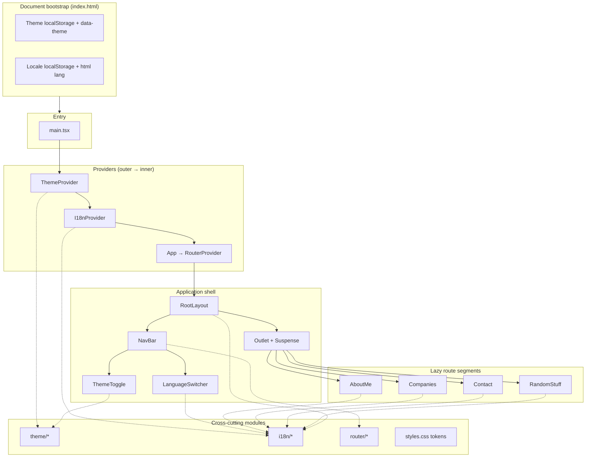
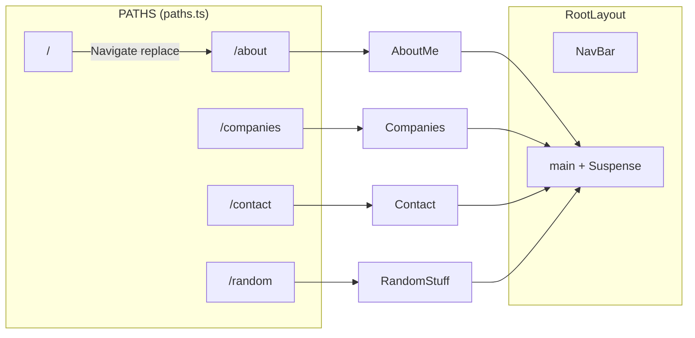

# `@org/portfolio`

Staff-engineer portfolio SPA: **React 19**, **Vite**, **React Router**, with **typed i18n** (5 locales, default English), **theme** (light / dark / system), and **code-split** route chunks.

## Run (from monorepo root)

```bash
npx nx serve @org/portfolio
npx nx build @org/portfolio
npx nx run @org/portfolio:typecheck
npx nx run @org/portfolio:lint
```

---

## Architecture (layers)



**Dependency rule of thumb:** UI components depend on **`useI18n`** / **`useTheme`** and **`router`** path constants; they do not import message JSON directly. Copy lives in **`i18n/messages/*`**; **`MessageKey`** paths are the single API for strings.

---

## Routing & layout mapping



| URL path     | `PATHS` constant   | Page component | Bundle     |
| ------------ | ------------------ | -------------- | ---------- |
| `/`          | `ROOT`             | → redirect     | —          |
| `/about`     | `ABOUT`            | `AboutMe`      | lazy chunk |
| `/companies` | `COMPANIES`        | `Companies`    | lazy chunk |
| `/contact`   | `CONTACT`          | `Contact`      | lazy chunk |
| `/random`    | `RANDOM`           | `RandomStuff`  | lazy chunk |

Nav labels are **not** hard-coded in the bar: **`navConfig.ts`** pairs each `AppPath` with a **`MessageKey`** (e.g. `nav.about`).

---

## Source directory map

```text
app/portfolio/
├── index.html              # Vite entry; inline bootstraps for theme + locale
├── vite.config.mts
├── package.json            # @org/portfolio deps (react, react-dom, react-router-dom)
└── src/
    ├── main.tsx            # ThemeProvider → I18nProvider → App
    ├── styles.css          # Design tokens, [data-theme] light/dark, reset
    ├── app/
    │   └── app.tsx         # RouterProvider(router)
    ├── router/
    │   ├── paths.ts        # PATHS + AppPath (typed segment source of truth)
    │   ├── navConfig.ts    # route → MessageKey for NavBar
    │   └── index.tsx       # createBrowserRouter, lazy pages, RootLayout
    ├── layouts/
    │   ├── RootLayout.tsx  # shell: mesh/grain, NavBar, Suspense, Outlet
    │   └── RootLayout.module.css
    ├── components/
    │   ├── NavBar/
    │   ├── ThemeToggle/
    │   ├── LanguageSwitcher/
    │   └── SectionHeader/
    ├── pages/
    │   ├── AboutMe/
    │   ├── Companies/
    │   ├── Contact/
    │   └── RandomStuff/
    ├── theme/              # preference + resolved theme, DOM sync, storage
    └── i18n/               # locales, MessageKey, bundles, translate(), I18nProvider
        └── messages/
            ├── en.ts       # canonical tree → Messages type
            ├── de.ts | es.ts | fr.ts | ja.ts   # satisfies Messages
            └── bundles.ts  # Record<Locale, Messages>
```

---

## Module responsibilities

| Module        | Responsibility |
| ------------- | -------------- |
| **`theme/`**  | `ThemePreference` (`light` \| `dark` \| `system`), `resolveTheme`, `localStorage`, `useSyncExternalStore` for OS scheme, `applyThemeToDocument` (`data-theme`, `color-scheme`, meta `theme-color`), cross-tab `storage` events. |
| **`i18n/`**   | `Locale` (`en` default + `de`,`es`,`fr`,`ja`), `MessageKey` (dot paths from `messages/en.ts`), `translate(locale, key)` with **en fallback**, `I18nProvider` (`t`, `setLocale`, document `lang` / `title` / meta description), cross-tab sync. |
| **`router/`** | Single router instance; **lazy** imports per page; index redirect to **`PATHS.ABOUT`**. |
| **`layouts/`** | Atmospheric background layers + **Suspense** fallback (localized “Loading”). |
| **`components/`** | **NavBar** (routes + language + theme), reusable **SectionHeader**, accessible **LanguageSwitcher** (listbox pattern). |

---

## Styling model

- **Global tokens** in `styles.css`: spacing, typography, motion, and **semantic colors** overridden under **`[data-theme="light"]`** / default dark.
- **CSS Modules** per feature component / page for layout and states.
- **ThemeToggle** / **LanguageSwitcher** / **NavBar** share the same glass + amber accent language as the rest of the shell.

---

## Extension points

1. **New route:** Add `PATHS` + lazy import in `router/index.tsx` + page folder + **`navConfig`** row + message keys in all **`messages/*.ts`** files.
2. **New string:** Add leaf under **`messages/en.ts`**, mirror in other locales (`satisfies Messages`), use **`t('your.key')`** with `MessageKey` typing.
3. **New locale:** Extend **`SUPPORTED_LOCALES`** in **`i18n/constants.ts`**, add `messages/<code>.ts`, register in **`bundles.ts`**, add **`lang.<code>`** labels and **`index.html`** bootstrap allow-list if used.
