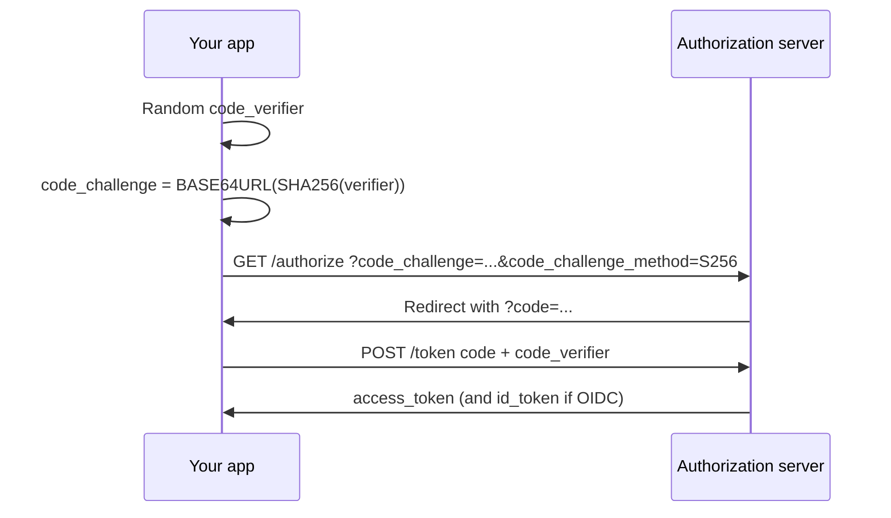

# @org/pkce-identity

Small, framework-agnostic **TypeScript** helpers for **OAuth 2.0 Authorization Code** with **PKCE** (Proof Key for Code Exchange), [RFC 7636](https://www.rfc-editor.org/rfc/rfc7636). This library **implements the PKCE algorithm and URL/body builders** itself; it does not depend on `oidc-client-ts` or other OIDC clients.

Use it when you want full control over `fetch`, storage, and UI, while still following the standard crypto steps for public (browser) clients.

---

## What PKCE does (short)

Public clients cannot keep a **client secret** in the browser. PKCE adds a per-request **code_verifier** / **code_challenge** pair so that an intercepted authorization **code** cannot be exchanged for tokens without the **verifier** your app generated locally.



---

## API

### PKCE primitives (RFC 7636)

| Export | Purpose |
|--------|---------|
| `generateCodeVerifier(entropyBytes?)` | High-entropy **code_verifier** (default 32 bytes → base64url → 43 chars). |
| `createS256CodeChallenge(verifier)` | **code_challenge** for method `S256`. |
| `createPkcePair()` | Convenience: `{ codeVerifier, codeChallenge, codeChallengeMethod: 'S256' }`. |
| `PKCE_CODE_CHALLENGE_METHOD_S256` | Constant `'S256'`. |

Requires **Web Crypto** (`globalThis.crypto.subtle`): modern browsers and **Node.js 20+** (global `crypto`).

### Authorization URL (OAuth 2.0)

`buildAuthorizationUrl(authorizationEndpoint, params, extraQuery?)`

- Sets `response_type`, `client_id`, `redirect_uri`, `scope`, `state`, `code_challenge`, `code_challenge_method`.
- Optional `nonce` (OpenID Connect).
- `extraQuery` for provider-specific parameters.

### Token endpoint (authorization code + PKCE)

`buildAuthorizationCodeTokenBody(request)`

- Builds an `application/x-www-form-urlencoded` body with `grant_type=authorization_code`, `code`, `redirect_uri`, `client_id`, **`code_verifier`**, and optional `client_secret` for providers that still require it.

---

## Usage sketch

```typescript
import {
  createPkcePair,
  buildAuthorizationUrl,
  buildAuthorizationCodeTokenBody,
} from '@org/pkce-identity';

// 1) Before redirect — store code_verifier keyed by `state` (e.g. sessionStorage)
const { codeVerifier, codeChallenge, codeChallengeMethod } =
  await createPkcePair();
const state = crypto.randomUUID();
sessionStorage.setItem(`pkce:${state}`, codeVerifier);

// 2) Redirect user to IdP
const url = buildAuthorizationUrl('https://accounts.google.com/o/oauth2/v2/auth', {
  responseType: 'code',
  clientId: import.meta.env.VITE_CLIENT_ID,
  redirectUri: `${location.origin}/callback`,
  scope: 'openid email profile',
  state,
  codeChallenge,
  codeChallengeMethod,
});
location.assign(url);

// 3) On /callback — read `code` and `state`, load code_verifier, POST token endpoint
const stored = sessionStorage.getItem(`pkce:${state}`);
const body = buildAuthorizationCodeTokenBody({
  grantType: 'authorization_code',
  code,
  redirectUri: `${location.origin}/callback`,
  clientId: import.meta.env.VITE_CLIENT_ID,
  codeVerifier: stored!,
});
const res = await fetch('https://oauth2.googleapis.com/token', {
  method: 'POST',
  headers: { 'Content-Type': 'application/x-www-form-urlencoded' },
  body,
});
```

You remain responsible for **CORS**, **state validation**, **secure storage** of the verifier, and **OIDC** validation of `id_token` if you use OpenID Connect.

---

## Security notes

- Use **HTTPS** in production; register exact **redirect URIs** at the provider.
- **`state`**: must be unpredictable; validate on callback to prevent CSRF.
- Store **`code_verifier`** only for the short window between auth start and token exchange (e.g. `sessionStorage`); prefer clearing after use.
- This package does **not** implement JOSE/JWT validation or threat models beyond the PKCE transform.

---

## Normative references

- [RFC 6749](https://www.rfc-editor.org/rfc/rfc6749) — OAuth 2.0
- [RFC 7636](https://www.rfc-editor.org/rfc/rfc7636) — PKCE
- [OpenID Connect Core](https://openid.net/specs/openid-connect-core-1_0.html) — OIDC on top of OAuth 2.0

---

## Nx

```bash
pnpm nx test pkce-identity
pnpm nx lint pkce-identity
pnpm nx run pkce-identity:typecheck
```

Import path in this monorepo: `@org/pkce-identity` (see `tsconfig.base.json` `paths`).

If `nx show projects` does not list `pkce-identity` yet, refresh the Nx project graph: `pnpm exec nx reset` (or restart the Nx Console / daemon), then run `pnpm exec nx sync` so TypeScript project references stay aligned.
